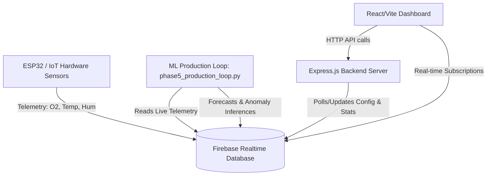

# DRDO O2 Sentinel 🛡️

**O2 Sentinel** is a comprehensive, real-time oxygen monitoring, analysis, and predictive safety management system. It integrates IoT hardware sensors, an Express.js backend, a React/Vite/TypeScript dashboard, and a Python Machine Learning pipeline to track oxygen concentration levels, identify anomalies, detect environmental drift, and predict potential hazards.

---

## 🏗️ System Architecture



---

## 📂 Repository Structure

The project is structured into the following main directories:

*   **[dashboard/frontend/](file:///C:/Users/akans/OneDrive/Desktop/DRDO/O2.monitoring/dashboard/frontend)**: React + Vite web dashboard built with TypeScript, Recharts, and Firebase.
*   **[dashboard/backend/](file:///C:/Users/akans/OneDrive/Desktop/DRDO/O2.monitoring/dashboard/backend)**: Express.js backend providing API routes for telemetry stats, environment recommendations, and system health checks.
*   **[ml_model/](file:///C:/Users/akans/OneDrive/Desktop/DRDO/O2.monitoring/ml_model)**: Python scripts for synthetic data generation, feature engineering, model training, anomaly detection, and the production serving loop.
*   **[hardware/](file:///C:/Users/akans/OneDrive/Desktop/DRDO/O2.monitoring/hardware)**: IoT firmware configuration, ESP32 device definitions, and hardware/sensor specifications.

---

## 💻 Component Details

### 1. Frontend Dashboard (`/dashboard/frontend`)
A highly responsive, real-time dashboard displaying environmental health metrics:
*   **Real-time Gauges**: Indoor Oxygen status, Temperature, and Humidity.
*   **Predictive Telemetry Charts**: Uses XGBoost model predictions to plot 5-minute and 10-minute oxygen forecasts and 15-point projections.
*   **Alert Hub**: Visual alert management system where active warnings/critical alerts can be reviewed, acknowledged, and historical logs checked.
*   **System Health Monitor**: Keeps track of ESP32 device logs, battery status, and latency syncing indicators.

### 2. Backend Server (`/dashboard/backend`)
An Express.js server acting as a bridge between the frontend and database configurations:
*   **Modular API Routing**: Integrates endpoints for `/api/sensors`, `/api/alerts`, `/api/device`, `/api/recommendations`, `/api/stats`, and `/api/system`.
*   **Recommendation & Alert Engines**: Serves computed recommendations based on sensor trends and threshold configurations.

### 3. Machine Learning Pipeline (`/ml_model`)
A multi-stage Python pipeline running state-of-the-art predictive algorithms:
*   **Feature Engineering**: Computes rolling averages, differences, lag features, and time-based metrics.
*   **Model Training**: Trains Random Forest and XGBoost regression models for 5-minute and 10-minute forecasting horizons.
*   **Anomaly & Drift Detection**: Applies an Isolation Forest model to detect point anomalies and a CUSUM (Cumulative Sum) algorithm to catch sensor drift.
*   **Production Serving Loop**: A continuous process that fetches the latest database records, runs inferences, writes warnings and recommendations back to Firebase, and logs performance.

---

## 🗄️ Database Schema (Firebase Realtime Database)

The database utilizes the following structure:
```json
{
  "sensors": {
    "room1": {
      "readings": {
        "-O9xK3...": {
          "oxygen": 20.9,
          "temperature": 24.5,
          "humidity": 45.2,
          "timestamp": "2026-07-07T15:00:00Z",
          "source": "esp32_main_01"
        }
      }
    }
  },
  "predictions": {
    "room1": {
      "readings": {
        "-O9xk5...": {
          "oxygen_current": 20.9,
          "oxygen_forecast_5min": 20.88,
          "oxygen_forecast_10min": 20.85,
          "model_version": "XGBoost v1",
          "is_anomaly": 0,
          "iso_score": 0.02,
          "rec_severity": "OK",
          "rec_message": "Air quality normal.",
          "timestamp": "2026-07-07T15:00:00Z"
        }
      }
    }
  },
  "alerts": {
    "room1": {
      "alert_id": {
        "message": "Oxygen predicted low in 10 min. Prepare ventilation.",
        "severity": "PREDICTIVE_WARNING",
        "timestamp": "2026-07-07T15:00:00Z",
        "acknowledged": false
      }
    }
  }
}
```

---

## 🚀 Setup & Execution Guide

### 📂 Prerequisites
*   [Node.js](https://nodejs.org/) (v18+)
*   [Python 3.9+](https://www.python.org/)
*   Firebase Project with a Realtime Database.

---

### 1️⃣ Machine Learning Pipeline Setup (`/ml_model`)

1. Navigate to the `ml_model` folder:
   ```bash
   cd ml_model
   ```
2. Install Python dependencies:
   ```bash
   pip install -r requirements.txt
   ```
3. Place your Firebase private key JSON file inside the `ml_model` directory as `serviceAccountKey.json`.
4. Configure your database URL and thresholds in config.py.
5. Start the ML Production Serving Loop:
   ```bash
   python phase5_production_loop.py
   ```

---

### 2️⃣ Backend Server Setup (`/dashboard/backend`)

1. Navigate to the `dashboard/backend` folder:
   ```bash
   cd dashboard/backend
   ```
2. Install dependencies:
   ```bash
   npm install
   ```
3. (Optional) Setup your local environment variables in a `.env` file.
4. Run the backend server:
   ```bash
   npm run dev
   ```
   *The API will be available at: http://localhost:5000*

---

### 3️⃣ Frontend Dashboard Setup (`/dashboard/frontend`)

1. Navigate to the `dashboard/frontend` folder:
   ```bash
   cd dashboard/frontend
   ```
2. Install dependencies:
   ```bash
   npm install
   ```
3. Configure your Firebase credentials in the `.env` file.
4. Run the Vite local development server:
   ```bash
   npm run dev
   ```
   *The dashboard will be available at: http://localhost:5173*

---

## 🔒 Security & Sensitivity  Controls
To protect configurations, certificates, and local assets, the project implements a strict root-level [.gitignore](file:///C:/Users/akans/OneDrive/Desktop/DRDO/O2.monitoring/.gitignore) file which prevents the following from being pushed to version control:
*   Firebase service account keys (`serviceAccountKey.json`, etc.).
*   Local environment secrets (`.env`, `*.env`).
*   Pre-compiled machine learning weights (`*.pkl`, `*.onnx`).
*   Large training datasets (`*.csv`).
*   Local database files (`*.db`, `*.sqlite`).
*   Build caches, node modules, and system files (`node_modules/`, `dist/`, `.DS_Store`).
